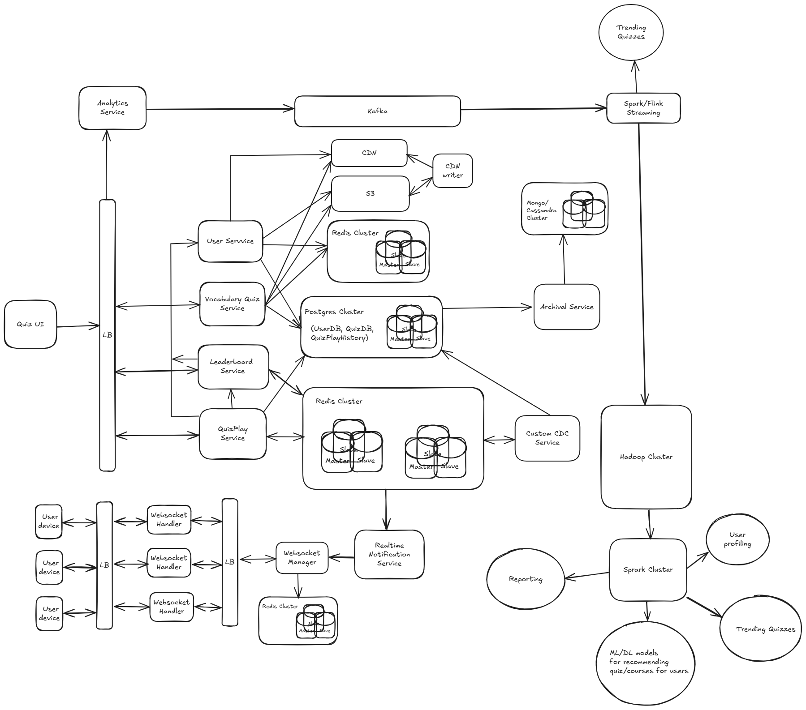
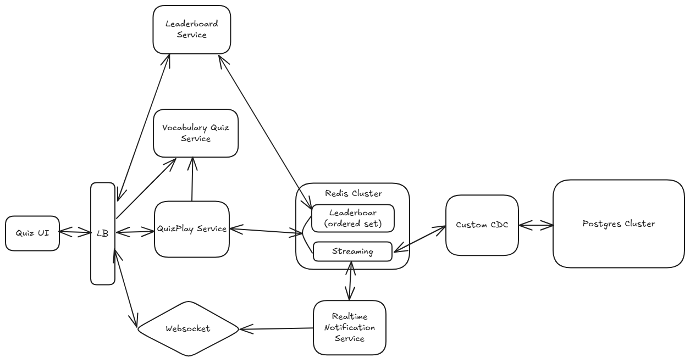
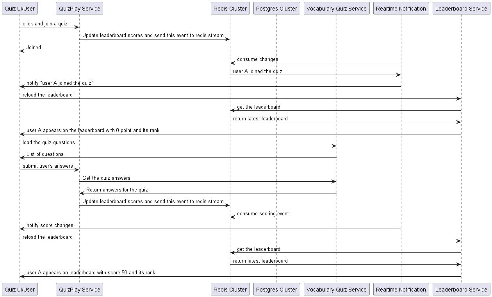

# Real-Time Vocabulary Quiz System
This project involves creating a Real-Time Quiz Feature for an English learning application, where users can participate in quizzes, compete with others, and see their scores updated live on a leaderboard. The project focuses on system design, real-time functionality, scalability, and performance.

## Demo
[Visit here](https://drive.google.com/file/d/1mX6ds17MT2Z-q11JPuJvGlHQTyCCKF41/view?usp=drivesdk)
## Functional Requirements
- Multiple users can join a quiz session and play it.
- Users can submit answers and their scores should be updated in real-time, the scoring system must be accurate and consistent.
- Leaderboard for a quiz should display the current standings of all participants (top **k** users + **m** users around him).
- Be able to extend leaderboard to many types such as: daily, weekly, monthly.
- Be able to view quiz challenge histories.
## Non-functional Requirements
  - Low latency
  - High availability
  - Reliability
  - Minimal operational overhead
  - Scalability
## Back of the Envelope Estimation
  - MAU: 50 million
  - DAU: 10 million (100 users/s on average => 1000 users/s at peak)
  - QPS for users: assuming a user plays 10 games a day. Hence, QPS = 10000.
  - QPS for leaderboard: 1000

Assuming that, we need to store the user id and score. 
+ 15 character string(15 bytes) for user_id 
+ a 64-bit (8 bytes) integer for the score
+ overhead: 30 (bytes)

=> ~ 50 bytes

So total memory required on a monthly basis would be 50*50 million bytes i.e. 2500 MB memory.
## Redis Sorted Set
```angular2html
ZADD leaderboard:quiz_id score user_id
---------------------------------------
(extendable)
ZADD leaderboard:123:daily 5000 user1
ZADD leaderboard:123:weekly 3000 user2
ZADD leaderboard:123:monthly 4500 user3
```
Commands to use
```angular2html
ZADD: to join users to a quiz session (O(log(n)))
ZINCRBY: to update scores (O(log(n)))
ZSCORE: to get a user score (O(log(n)))
ZREVRANK: to get the rank of a user (O(log(n)))
ZREVRANGE: to get top k users/players in the leaderboard (O(log(n) + k)), get m users around the current user rank (O(log(n) + m))
```
## High level design

### Components
#### 1. Load Balancer (LB)
The gateway between services. Not only handling load balancing but also:
- Authentication & Authorization
- Rate Limiting & IP Restrictions
#### Quiz UI
The user interface for quiz application: web, mobile apps.  

Via **LB**, interact with:
- **Vocabulary Quiz Service** to get quizzes info, quiz histories to display to users.
- **QuizPlay Service** to start playing a quiz and submit answers.
- **Leaderboard Service** to get the ranking of users amongst other users and top k users.
- **Websocket Handler** to get realtime update on leaderboard and other stuff.
#### 2. User Service
Manages user data and interacts with the Postgres Cluster for user-related information.

Interact with:
- **S3**, a blob storage, or **CDN** to store and get users' profile photos.
- **Postgres Cluster** to save user data.
- **Redis Cluster** to cache and retrieve some user data to avoid hitting to Postgres everytime.
#### 3. Vocabulary Quiz Service
Handles vocabulary quizzes and accesses quiz-related data from the Postgres Cluster.

Interact with:
- **S3** or **CDN** to upload or get some media contents for quizzes (a quiz may contain audio or images or videos).
- **Postgres Cluster** to retrieve or update quizzes.
- **Redis Cluster** to cache and retrieve some quiz data to avoid hitting to Postgres everytime.

#### 4. Leaderboard Service
Provide access to leaderboard related info

Interact with:
- **Redis cluster** to get leaderboard related info
- **UserService** to get some user info to display in leaderboard such as name or avatar for top users.

#### 5. QuizPlay Service
The service to start playing a quiz and update scores in the leaderboard.

Interact with:
- **Redis Cluster** to update users' scores in the leaderboard in an **ordered set** and put events to a Redis stream which later are consumed by **Custom CDC Service** for persisting quiz play histories.
- **Postgres Cluster** to get quiz play histories.

#### 6. Websocket Handler & Websocket Manager
**Websocket Handler**: handle sending realtime changes to clients.
**Websocket Manager**: When scaling websockets each **Websocket Handler** is responsible for handling a certain numbers of connections and devices, **Websocket Manager** helps this and store them in Redis.

#### 7. Realtime Notification Service
Keep track of changes in the leaderboard via PubSub channel in Redis then applying a wise strategy for deliver them to clients, especially in high traffic situations.

#### 8. Archival Service
It is a good fit to keep track of quiz play progress in a relational database. However, overtime data increases then relational database performance is also affected. This service is going to archive completed quiz session into a NoSQL DB to ensure relational database operation.
#### 9. Analytics Service
It is used for analyzing users' behaviors in the system so that we can provide them with best services.
#### 10. Analytics and Hadoop Ecosystem
Our system should intelligently understand users to provide personalized services, not behave like a machine. For example, when users take a quiz, we can track metrics like time spent, replay frequency, and commonly missed question types. These insights help us recommend suitable courses or quizzes based on their needs. 

This is where Analytics Services and the Hadoop Ecosystem come into play.

**Kafka**: queue for collecting logs.

**Spark/Flink Streaming**: Support for realtime or micro-batch processing data from Kafka, we can do some realtime data processing here like finding trending quizzes.

**Hadoop**: Serves as a data lake for storing large volumes of raw data from users so that we can do further analytics

**SparkCluster**: We can run some spark jobs for User Profiling, Trending Quizzes, Recommendations (via Machine Learning or Deep Learning models) and some reporting jobs like the number of users enrolling courses, etc.
### Dataflow


Sequential flow for joining and updating score and leaderboard



Note: When receiving a score change event, we can consider the following strategies:

- Reload the leaderboard to update both the scores and rankings, showing the top **k** users and **m** users around the current user.
- Update only the user's score immediately, and refresh the entire leaderboard periodically at a less frequent interval.

Anyway, the choice depends on the problem requirements and involves some trade-offs.
### Technical Challenges
#### 1. Hotspots & data sharding
It's when a quiz becomes "hot".

##### Sharding data by user_id/username using consistent hashing
- makes data distributed evenly => solve the hotspots

Tradeoff (Acceptable):
- adds a latency to finding top k users in the leaderboard because we need to merge top k local users.
- adds a latency to getting user rank because we need to aggregate the local rank of the user to k top users.
##### Sharding data by quiz_id using consistent hashing (not use builtin redis hash slot)
- makes getting top k users and user rank located on 1 node without any overhead

Tradeoff:
- Cannot resolve hotspots
##### Adding replicas for sharing read
Under any circumstances, adding replicas is necessary to share read load


=> Combining both sharding by users and quiz_id: sharding by quiz_id for regular quizzes then sharding by users when they are "hot". 
#### 2. Realtime notification for a large amount of traffic
- Push-based model and Websockets
- Scale websockets (state machine for websocket manager)
- Wise strategies:
  + Categorizing urgent events, less critical data is used with pull model periodically. For example, we update user's score rank immediately but only refresh the whole dashboard when user's rank is changed.
  + Mini-batching technique
  + Backoff with jiter (both client and server)
- Using circuit breaker
#### 3. Hybrid Persistence
Combining both Snapshot and AOF
#### 4. Auto-scaling
- Dynamic port instance scaling with internal traffic gateway (like Traefik).
- Use some container orchestration technologies like K8s or Nomad & Consul.

#### 5. Monitoring
- Building healthz api for api services, use heartbeat/watchdog pattern or logging to monitor worker services.
- Using telegraf, prometheus, influx to monitor resource consumption, gateway logging.

#### 6. Further development
Many types of leaderboard, support any time range, approximation approach should be in consideration.
##### Precise solution
- using publishing service -> kafka -> spark streaming -> hadoop (parquet files) -> leaderboard
- mapreduce -> local top k then merge into global top k
##### Approximation solution
Many layers:
- Windowed top k: Spark streaming -> Flink cluster -> TSDB 
- Count Min Sketch: Kafka -> CMS (master - replica) -> TSDB
